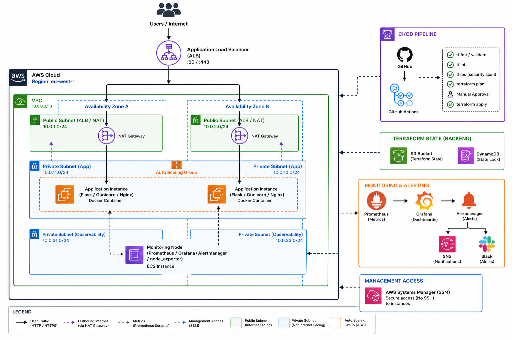
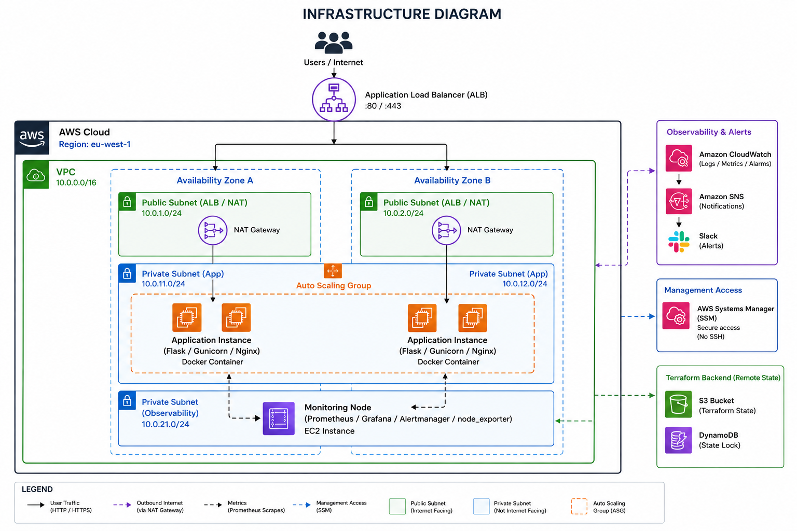
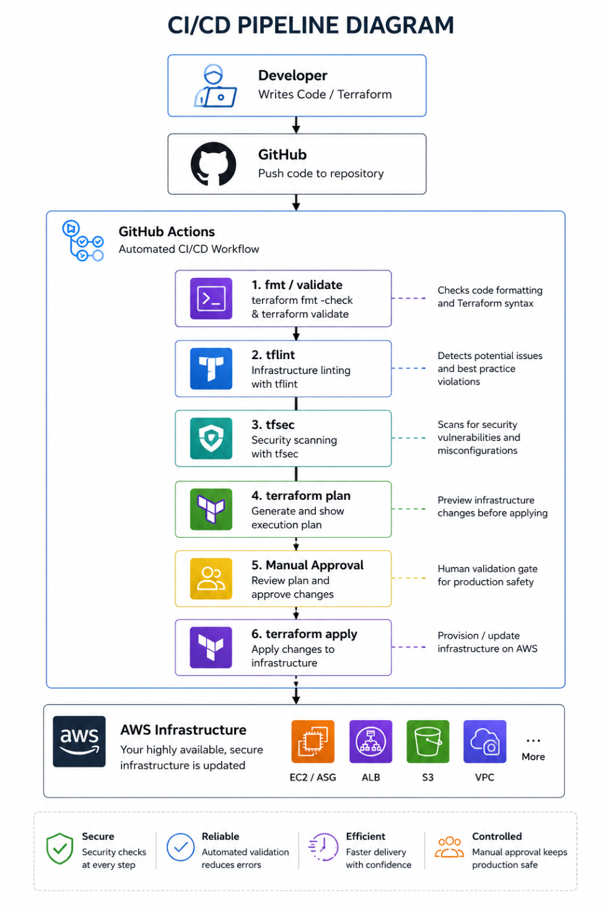
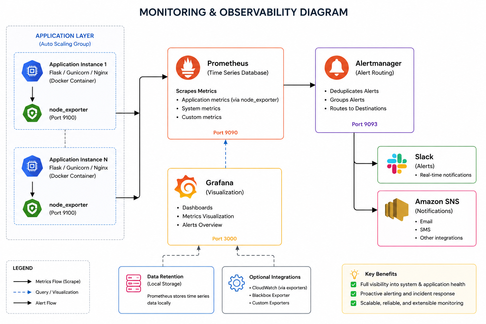

# High-Availability AWS Production Platform & Observability Stack


A production-style, highly available web platform on AWS, built to fix three specific failures a single-instance Flask deployment kept hitting: outages under traffic spikes, no automatic recovery from instance failure, and zero visibility into whether the app was actually healthy before a customer noticed it wasn't.

## The Problem
The original deployment (see `prod-web-server`) ran a Flask app on one EC2 instance behind Nginx. It went down twice during traffic spikes with no way to absorb the load, and once when an OS patch left Nginx in a broken state that nobody caught until a customer complained. There was no load balancing, no automatic recovery, and no dashboard telling on-call what was wrong before it became a support ticket.

## The Solution
A VPC-native, Auto Scaling Group-backed platform behind an Application Load Balancer, provisioned entirely through modular Terraform with remote state locking, deployed via a GitHub Actions pipeline that requires a plan review and manual approval before anything touches production. Instance access has no SSH anywhere in the stack. Health is visible through a self-hosted Prometheus and Grafana stack running alongside CloudWatch, so a failing instance gets pulled from rotation and replaced automatically, and a human finds out from a Slack alert, not a customer.

## What This Demonstrates
This project was built deliberately from first principles, every resource provisioned by hand first, then automated, so the automation was understood before it was written. Every architectural decision is documented in an ADR with its tradeoffs. The infrastructure handles the two failure modes that motivated it: a traffic spike that would have taken down the original single instance routes cleanly across two AZs, and the Nginx patch incident that caused 42 minutes of downtime can no longer happen, the ALB catches it and the ASG replaces the instance before a customer notices.

## Architecture

A high-availability AWS ecosystem spanning two Availability Zones in eu-west-1, featuring a public ALB that routes web traffic to containerized Flask applications inside isolated private subnets. Managed via a DevSecOps GitHub Actions pipeline with remote S3/DynamoDB state locking, portless SSM management, and full-stack Prometheus/Grafana alerting.

## Infrastructure


Public and private subnets across two Availability Zones. The ALB sits in the public subnets and is the only internet-facing component. The Auto Scaling Group runs Flask/Gunicorn containers in the private subnets and is never directly reachable from the internet. Security groups only allow the ALB to talk to the instances, and only allow the instances to talk out through a single NAT Gateway (see ADR-0002 for why it's one, not two).

## Tech Stack
* **AWS:** VPC, ALB, ASG, EC2, NAT Gateway, S3, DynamoDB, IAM, SSM
* **IaC:** Terraform (modular: network, compute, security, observability), remote state in S3 with DynamoDB locking, **tflint**, **tfsec**
* **App:** Flask, Gunicorn, Docker, Nginx
* **CI/CD:** GitHub Actions (format check, tflint, tfsec security scan, plan-on-PR, manual approval gate to apply)
* **Observability:** Prometheus, node_exporter, Grafana, Alertmanager, CloudWatch, SNS
* **Scripting:** Bash, Python

## Project Structure
```
.
├── .github/workflows/       # CI/CD: terraform plan/apply, Docker build/push
├── app/                      # Flask application, Dockerfile
├── docs/
│   ├── adrs/                 # Architecture Decision Records
│   ├── operations/           # Postmortems, capacity planning
│   └── runbooks/              # On-call operational guides
├── monitoring/                # Prometheus, Alertmanager, Grafana configs
├── nginx/                     # Reverse proxy config
├── scripts/                   # Bootstrap and deploy scripts
└── terraform/
    └── modules/
        ├── network/           # VPC, subnets, routing, NAT
        ├── compute/            # ASG, launch template, ALB
        ├── security/           # Security groups, IAM
        └── observability/      # CloudWatch alarms, SNS
```

## Key Engineering Decisions
Every non-obvious choice in this platform is documented as an ADR, including the tradeoffs and what would need to change if the constraints did:

- [ADR-0001: SSM Session Manager over SSH](docs/adrs/0001-ssm-over-ssh.md), eliminating inbound management ports entirely.
- [ADR-0002: Single NAT Gateway](docs/adrs/0002-single-nat-gateway.md), a deliberate cost/availability tradeoff, not an oversight.
- [ADR-0003: Prometheus alongside CloudWatch](docs/adrs/0003-prometheus-over-cloudwatch.md), and why the platform runs both rather than picking one.

## How to Deploy


### Prerequisites

Before deploying this infrastructure, ensure you have the following:

1. **AWS CLI v2** installed and configured with appropriate IAM credentials.
2. **Terraform v1.5+** installed locally.
3. **S3 Backend Bucket & DynamoDB Table**: An S3 bucket for storing state files remotely and a DynamoDB table for state locking must exist prior to initialization.
   * Update the backend configuration in `terraform/main.tf` (or `backend.tf`) with your exact bucket name and region (`eu-west-1`).
4. **AWS SSM Session Manager Plugin** installed on your local machine for secure interactive EC2 access without SSH keys.

### Deployment Steps
```bash
# 1. Configure the remote backend (one-time, per environment)
cd terraform
terraform init

# 2. Review the plan
terraform plan -out=tfplan

# 3. Apply (in CI, this step requires manual approval after PR review)
terraform apply tfplan
```
In practice, deployment happens through the GitHub Actions pipeline: opening a PR triggers format checks, `tflint` static analysis, and `tfsec` security scans before generating a `terraform plan` that gets posted as a PR comment for review. Nothing applies to production without passing all security checks and receiving a manual approval gate review.

## Observability

Grafana is the primary day-to-day dashboard: request rate, latency, error rate per endpoint, and host-level metrics via node_exporter. Alertmanager routes threshold breaches to Slack. CloudWatch and SNS cover what only AWS can see directly, ALB target health, NAT Gateway metrics, and ASG lifecycle events. The reasoning behind running both is in ADR-0003.

## Documentation
- [Postmortem: Nginx downtime after OS patching](docs/operations/postmortem-nginx-patch-downtime.md), the incident this architecture was specifically built to prevent from recurring.
- [Runbook: EC2 access via SSM](docs/runbooks/ec2-ssm-access-guide.md), on-call reference for connecting to instances, reading logs, and triaging alerts.
